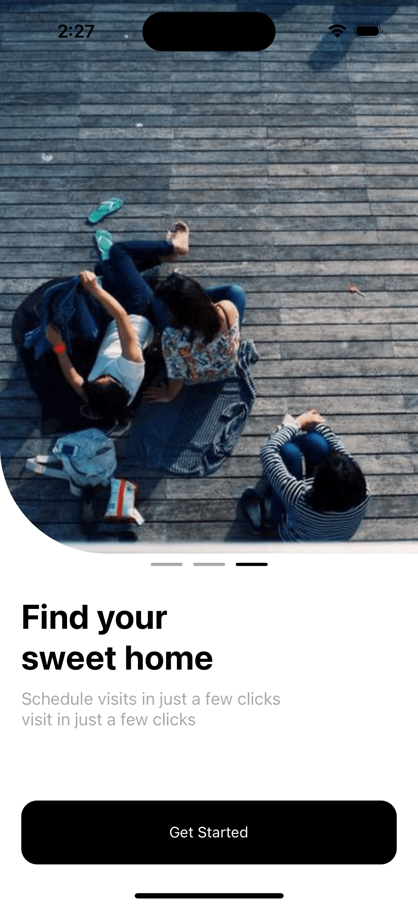
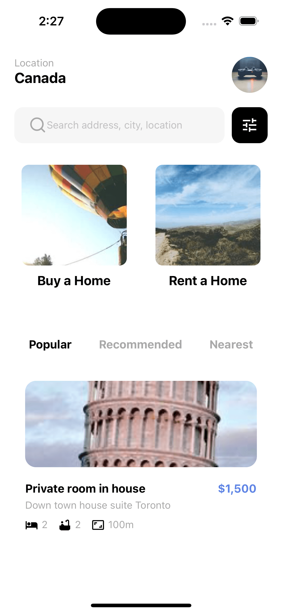
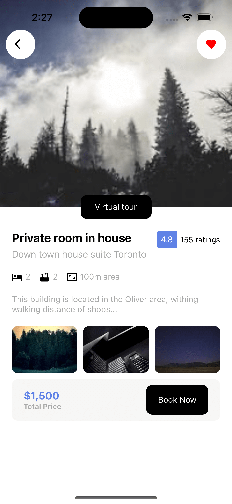

# Real Estate Clone Using React Native

# Step

1. use `npx create-expo-app -t expo-template-blank-typescript` this will init the project in typescript

2. add the web support `npx expo install react-dom react-native-web @expo/webpack-config`

3. add React Navigation both native and stack `yarn add @react-navigation/native @react-navigation/stack @react-navigation/native-stack @react-navigation/bottom-tabs`

4. add expo react navigation dependencies and add gesture handle `npx expo install react-native-screens react-native-safe-area-context react-native-gesture-handler`

# preview

| Landing                      | Home                         | Detail Page                  |
| ---------------------------- | ---------------------------- | ---------------------------- |
|  |  |  |
